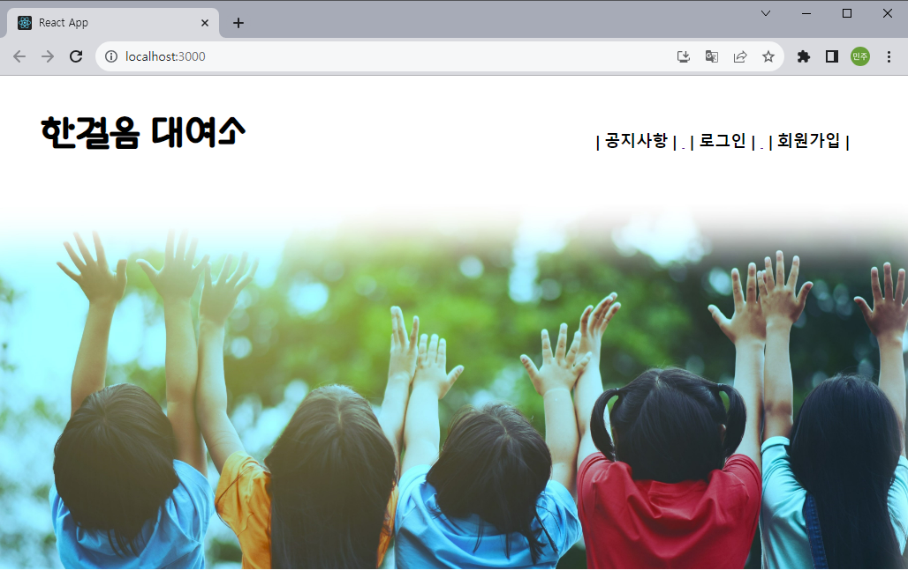
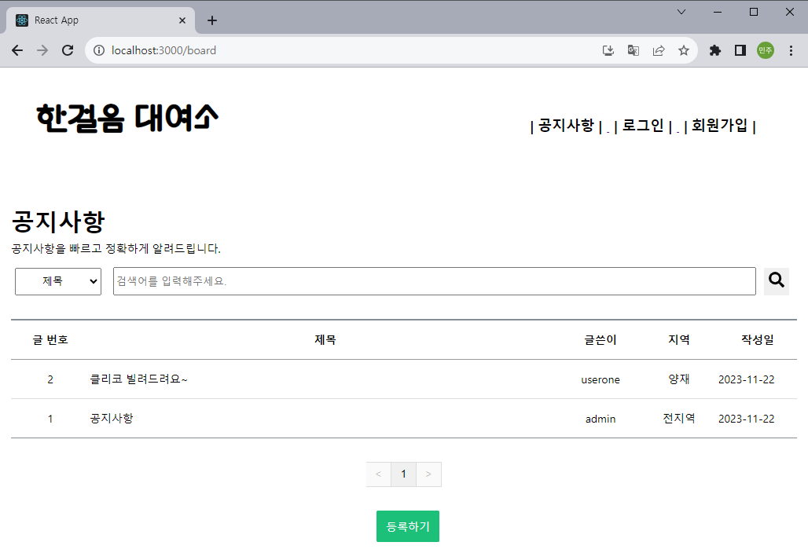
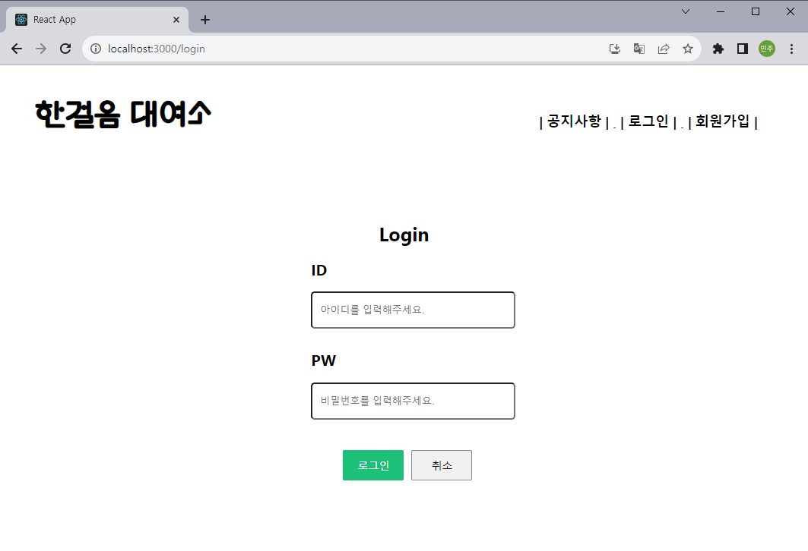
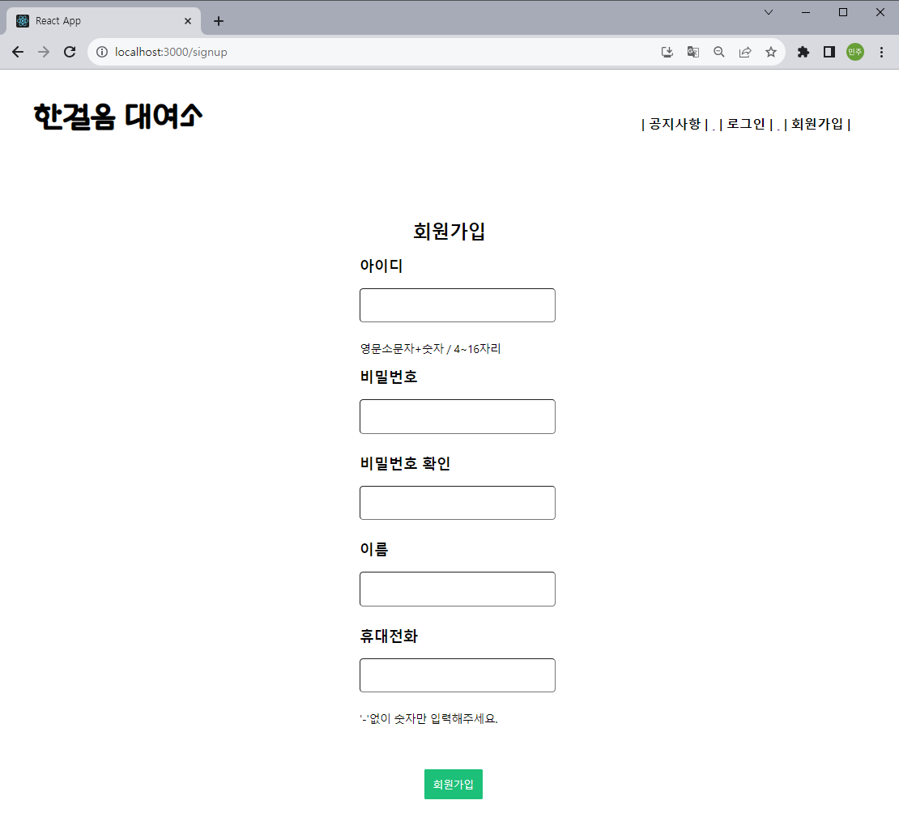
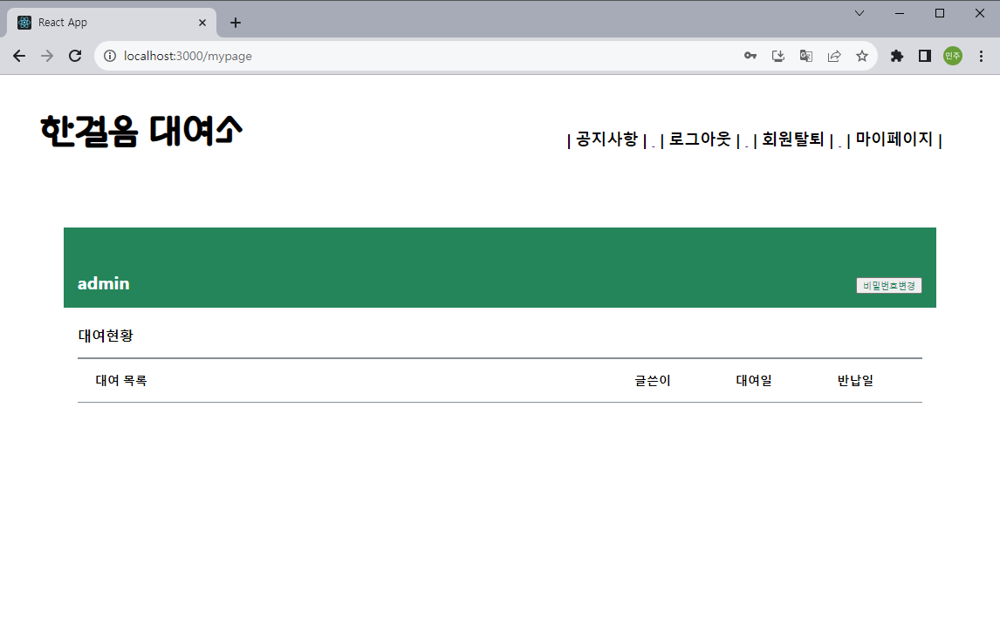
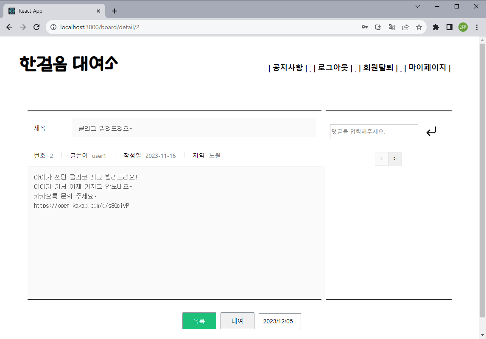
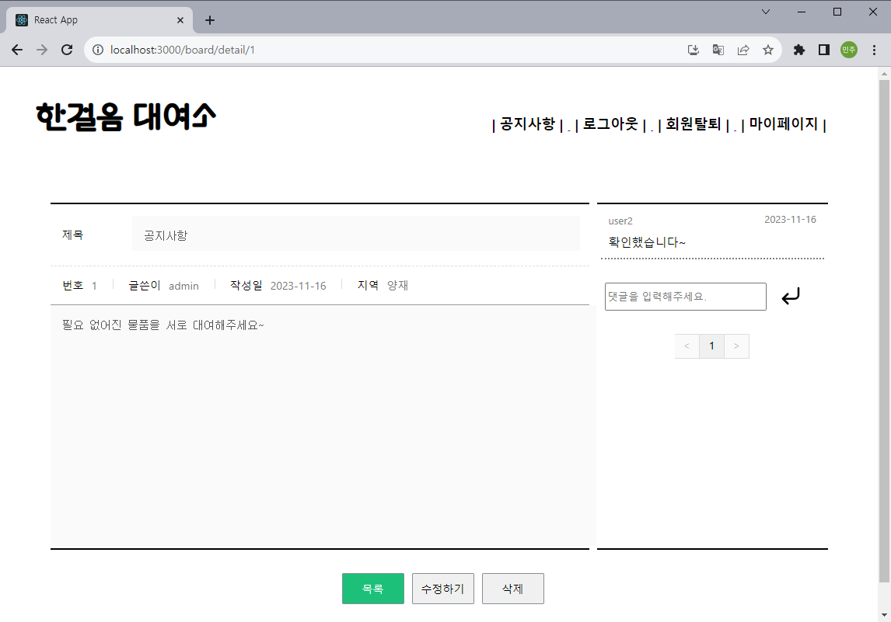

<h1 align="center">Welcome to FIRST STEP </h1>
<p>
</p>
<center>
    
</center>
<br>
> First Step / 한걸음 대여소 (신세계 I&C 2nd 모듈 프로젝트)<br>

## ✨ Description
```sh
필요한 물폼 혹은 필요 없는 물품을 서로 공유하며 더 좋은 세상으로 한 걸음 나아가는 커뮤니티
```
## 🤼‍♂️Author
```sh
🐯 **곽민주** : 마이페이지, 게시물 조회/수정/삭제, 게시물 대여/반납
🐉 **조수아** : 데이터베이스, 게시판, 게시물 대여/반납, 로그인/로그아웃, 회원탈퇴, 비밀번호 변경
🐺 **김기성** : 로그인
🐶 **김서연** : 팀장, 회원가입
🐱 **신명호** : 홈
```

## 🔍 기능
```sh
- 게시판 등록/수정/보기/삭제
- 로그인/로그아웃
- 회원가입/회원탈퇴
- 마이페이지(대여물품 조회, 비밀번호 변경)
- 게시물 대여/반납
```
## 🔧 기술 스택
### Front-end


### Backend
 
### Database

### Infra


## Architecture
<center>
        
</center>

## ✏️DB
<center>
        
</center>

## 🏃 Steps to run

### Backend

```bash
$ cd FIRSTSTEP_BE
$ python install -r requirements.txt
$ python server.py
```

### Frontend

```bash
$ cd FIRSTSTEP_FE
$ npm install
$ npm run
```

<br>
## 🔍 Overview
### 1. main 페이지
<center>
        
</center>

### 2. 공지사항 페이지
<center>
        
</center>

### 3. 로그인 페이지
<center>
        
</center>

### 4. 회원가입 페이지
<center>
        
</center>

### 5. 마이페이지
<center>
        
</center>

### 6. 상세 페이지
<center>
        
</center>
<center>
        
</center>
<br>