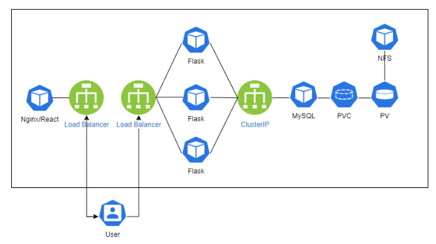

# FIRSTSTEP 한걸음 대여소
## 서비스 소개
필요한 물폼 혹은 필요 없는 물품을 서로 공유하며 더 좋은 세상으로 한 걸음 나아가는 커뮤니티

## 기능 
- 게시판 등록/수정/보기/삭제
- 로그인/로그아웃
- 회원가입/회원탈퇴
- 마이페이지(대여물품 조회, 비밀번호 변경)
- 게시물 대여/반납

## 팀원
|이름|담당|
|:---:|:---:|
|곽민주|마이페이지(대여 목록 조회), 게시물 조회/수정/삭제, 게시물 대여/반납|
|조수아|데이터베이스, 게시판, 게시물 대여/반납, 로그인/로그아웃, 회원탈퇴, 마이페이지(비밀번호 변경)|
|김기성|로그인|
|김서연|팀장, 데이터베이스, 회원가입|
|신명호|홈|

## 아키텍처

## 데이터베이스

## 기술 스택
### Front-end

### Backend
 

### Database

### Infra

